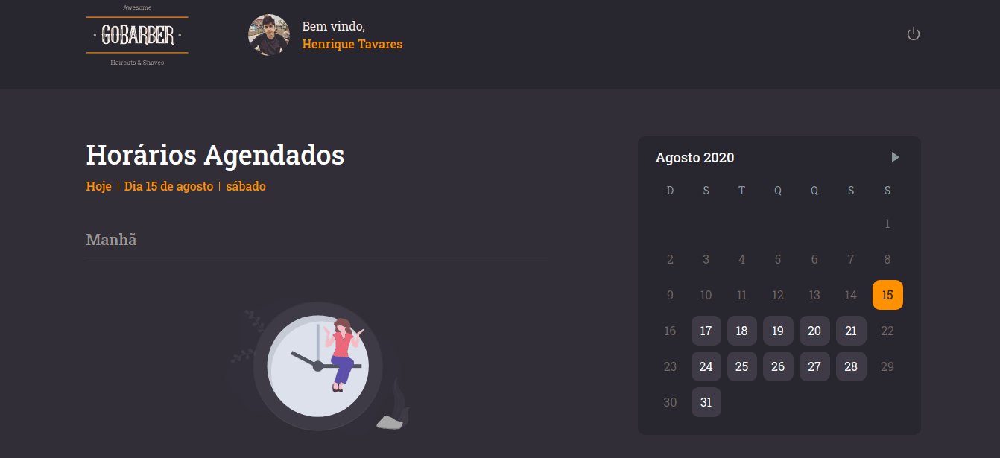

<h4 align="center">
  🚀 Go Barber Web
</h4>

<p align="center">
    <a href="#-technology">Technology</a>&nbsp;&nbsp;&nbsp;|&nbsp;&nbsp;&nbsp;
    <a href="#-project">Project</a>&nbsp;&nbsp;&nbsp;|&nbsp;&nbsp;&nbsp;
    <a href="#-executing">Executing</a>&nbsp;&nbsp;&nbsp;
</p>

<div align="center">
  
  
</div>

## :rocket: Tecnologias

:point_down: This project was developed with: :point_down:

- [ReactJS](https://pt-br.reactjs.org/)
- [TypeScript](https://www.typescriptlang.org/)
- [Axios](https://github.com/axios/axios)
- [date-fns](https://date-fns.org/)
- [Polished](https://github.com/styled-components/polished)
- [React Icons](https://react-icons.netlify.com/#/)
- [Styled Components](https://www.styled-components.com/)
- [yup](https://github.com/jquense/yup)
- [ESLint](https://eslint.org/)

## 🔖 Project

GoBarber is an app that allows users to schedule an appointment with their favorite barber and show the barber their schedule for the day.

## 💻 Executing

```bash
# Clone this project
$ git clone https://github.com/italo-lima/gobarber-web.git
# Join folder
$ cd gobarber-web
# Install dependencies
$ yarn 
# Run the project
$ yarn start
```
